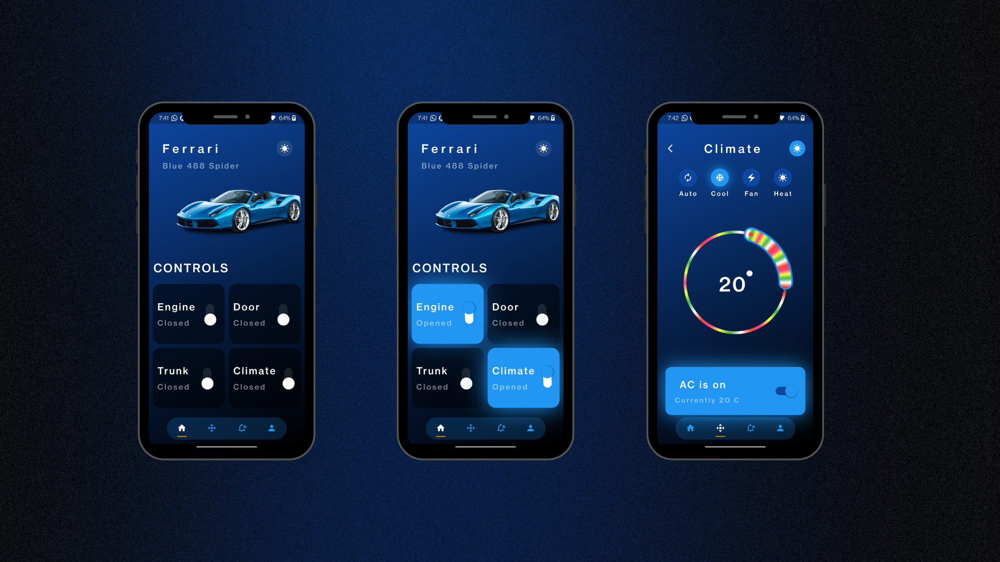

# Car Controller App 🚗

A Flutter UI application to control and monitor car functionalities remotely via Bluetooth or Wi-Fi.

## Features
- Start/stop the engine
- Lock/unlock doors
- Monitor car status

## Setup
1. Clone the repository
2. Run `flutter pub get`
3. Connect your device and run the app

---

Made with ❤️ using Flutter
